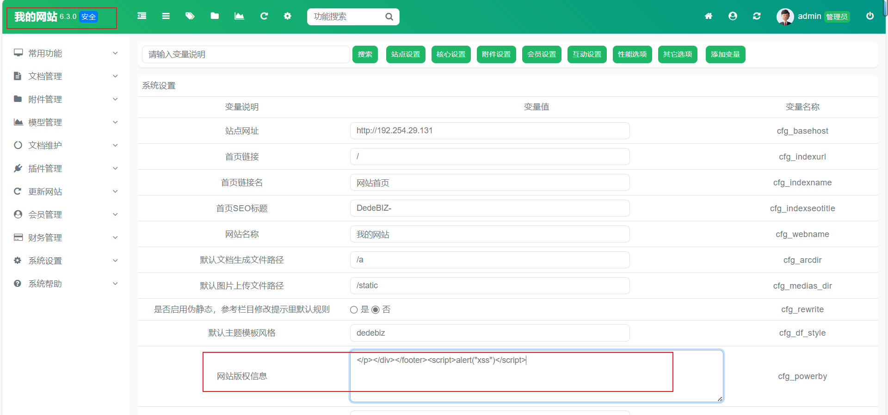
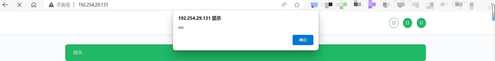
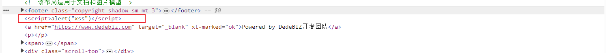

# DedeBiz 存在存储型 XSS 漏洞

## 介绍

dedebiz 6.3.0 存在存储型 XSS  漏洞, 在管理员后台站点设置处通过修改 `网站版权信息` 插入恶意 payload 可以执行任意 JS 代码, 对应源码可以去往官网下载 : https://www.dedebiz.com/download

## 验证

使用管理员账号登陆后台之后到达站点设置, 修改`网站版权信息`  为 `

</footer>`

随后点击保存, 并访问主页面可以发现 JS 代码执行

