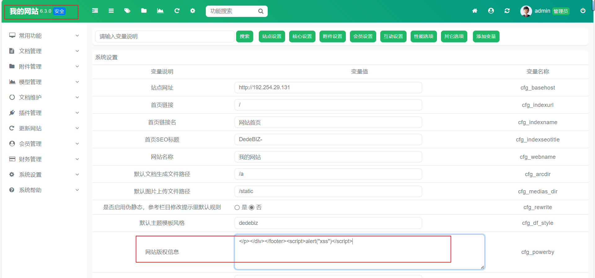
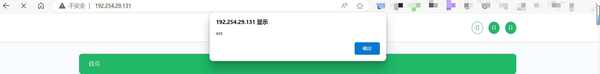
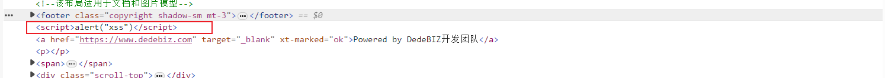

# DedeBiz A stored XSS vulnerability exists

## Desc

There is a stored XSS vulnerability in dedebiz 6.3.0. By modifying the `website copyright information` in the administrator backend site settings and inserting a malicious payload, arbitrary JS code can be executed. The corresponding source code can be downloaded from the official website: https://www.dedebiz.com/download

## Verify

Use the administrator account to log in to the backend and go to the site settings, modify the `website copyright information` to `

</footer>`

Then click Save, and visit the main page to find the JS code execution

