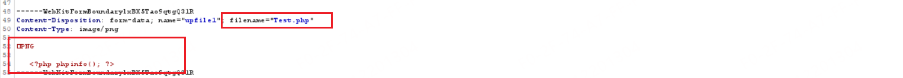

# DedeBIZ file upload

## Desc

When logging into the backend as an administrator, we can upload files in the attachment management section. Here, we can upload files, and the backend likely detects whether the uploaded file is an image based on its file signature. However, this means we can upload arbitrary PHP files, potentially leading to command execution.

## Verify

First, log in to the backend as an administrator and navigate to "Attachment Management" -> "Add Attachment."

Afterwards, fill in the attachment title and upload a regular image file.

Use Burp to intercept outgoing requests and modify the

- filename is changed to php suffix
- Image content: Modify the file content into PHP code while retaining the file magic number

After allowing the modified request to proceed, you should be able to see the uploaded file in the attachment management section.

After clicking on the "Edit" option, you should be able to view the file's upload path.

Now, we can see that our uploaded PHP file has been parsed and executed.

