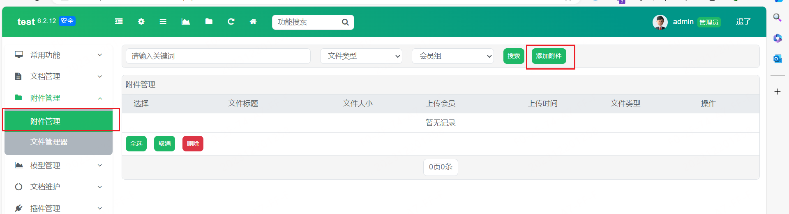
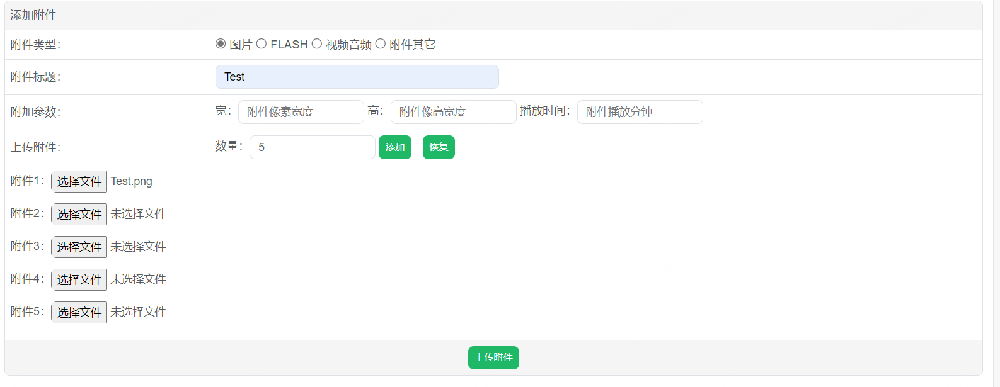
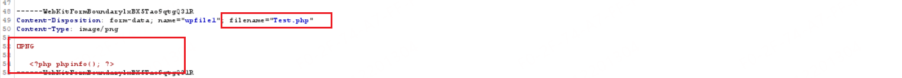
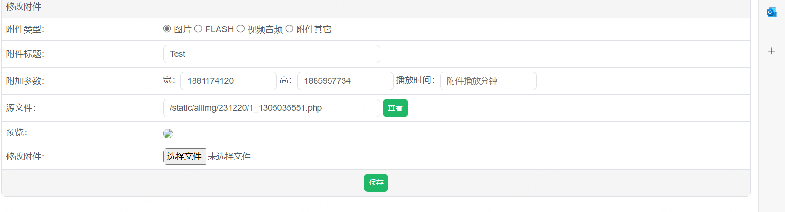
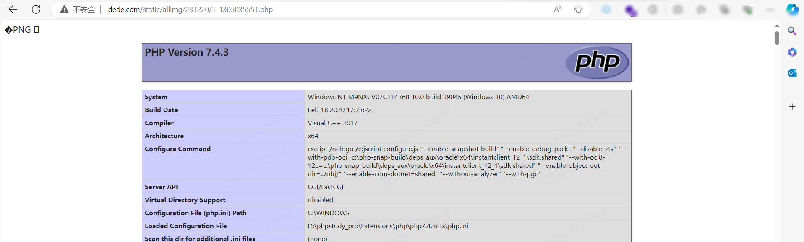

# DedeBIZ  文件上传漏洞

## 描述

在以管理员身份登录后台， 我们可以在附件管理处上传文件， 在这里我们可以上传文件， 其后端应该是通过文件幻数来检测上传的文件是不是图片， 因此我们可以任意 PHP 文件， 进而造成命令执行

## 验证

首先以管理员身份登录后台， 并访问 `附件管理` --> `添加附件` 

之后填写，附件标题， 并上传一个正常图片

使用 Burp 拦截发出的请求， 并修改请求中的

- filename 修改为 php 后缀
- 图片内容 ： 在保留文件幻数的基础上修改文件内容为 PHP 代码

之后放行 我们就可以在附件管理处看到上传的文件

之后点击修改， 我们就可以看到文件的上传路径

现在我们可以看到我们的上传的 PHP 文件被解析了

