# Mall4J 任意文件上传漏洞导致存储型 XSS

## 介绍

Mall4J <= 3.2 版本在用户上传文件时， 没有校验用户上传的文件类型,  导致恶意用户可以通过访问指定 API 发送请求来上传任意文件， 进而导致存储型 XSS 漏洞发生

## 验证

> PS ： 在我搭建的环境 `mall4uni` 中并没有出现文件上传的位置， 所以需要先访问后台找到对应的接口才可以进行， 但是在我提供的真实网站中， 用户的头像是可以进行修改的

- 搭建对应的环境， 安装 `mall4j` 、 `mall4v` 、 `mall4uni` 即可 （PS ： 为了演示方便下面对于 `AttachFileService##uploadFile` 源码进行了一些小修改 ）

查看其源码在 `\yami-shop-admin\src\main\java\com\yami\shop\admin\controller\FileController.java` 代码， 可以看到在用户上传文件时并没有验证用户的权限， 而是直接将其进行存储

```java
@RestController
@RequestMapping("/admin/file")
public class FileController {
	
	@Autowired
	private AttachFileService attachFileService;
	@Autowired
	private Qiniu qiniu;
	@Autowired
	private ImgUploadUtil imgUploadUtil;
	
	@PostMapping("/upload/element")
	public ServerResponseEntity<String> uploadElementFile(@RequestParam("file") MultipartFile file) throws IOException{
		if(file.isEmpty()){
            return ServerResponseEntity.success();
        }
		String fileName = attachFileService.uploadFile(file);
        return ServerResponseEntity.success(fileName);
	}
	
	@PostMapping("/upload/tinymceEditor")
	public ServerResponseEntity<String> uploadTinymceEditorImages(@RequestParam("editorFile") MultipartFile editorFile) throws IOException{
		String fileName =  attachFileService.uploadFile(editorFile);
		String data = "";
		if (Objects.equals(imgUploadUtil.getUploadType(), 1)) {
			data = imgUploadUtil.getUploadPath() + fileName;
		} else if (Objects.equals(imgUploadUtil.getUploadType(), 2)) {
			data = qiniu.getResourcesUrl() + fileName;
		}
        return ServerResponseEntity.success(data);
	}
}
```

之后查看 `AttachFileService##uploadFile` 方法的源码， 其在 `\yami-shop-service\src\main\java\com\yami\shop\service\impl\AttachFileServiceImpl.java#uploadFile`  中， 可以看到对于保存的文件后缀取决于用户上传的文件类型， 因此我们可以上传任意文件后缀的文件， 比如 ： jsp、html 等等，但是因为此系统默认不支持使用 JSP 因此不能解析 JSP 文件， 但是可以解析 html 格式文件， 进而形成存储型 XSS 漏洞

```java
	@Override
	@Transactional(rollbackFor = Exception.class)
	public String uploadFile(MultipartFile file) throws IOException {
		String extName = FileUtil.extName(file.getOriginalFilename());
		String fileName =DateUtil.format(new Date(), NORM_MONTH_PATTERN)+ IdUtil.simpleUUID() + "." + extName;
		AttachFile attachFile = new AttachFile();
		attachFile.setFilePath(fileName);
		attachFile.setFileSize(file.getBytes().length);
		attachFile.setFileType(extName);
		attachFile.setUploadTime(new Date());
		if (Objects.equals(imgUploadUtil.getUploadType(), 1)) {
			// 本地文件上传
			attachFileMapper.insert(attachFile);
			return imgUploadUtil.upload(file, fileName);
		} else {
			// 七牛云文件上传
			String upToken = auth.uploadToken(qiniu.getBucket(),fileName);
			Response response = uploadManager.put(file.getBytes(), fileName, upToken);
			Json.parseObject(response.bodyString(),  DefaultPutRet.class);
			return fileName;
		}
	}
```

> 后台默认配置是使用七牛云上传， 我没有找到对应的修改地方， 为了演示方便建议直接修改源码， 将原本的七牛云上传代码改为本地文件上传代码, 代码如下所示： 

```java
	@Override
	@Transactional(rollbackFor = Exception.class)
	public String uploadFile(MultipartFile file) throws IOException {
		String extName = FileUtil.extName(file.getOriginalFilename());
		String fileName =DateUtil.format(new Date(), NORM_MONTH_PATTERN)+ IdUtil.simpleUUID() + "." + extName;
		AttachFile attachFile = new AttachFile();
		attachFile.setFilePath(fileName);
		attachFile.setFileSize(file.getBytes().length);
		attachFile.setFileType(extName);
		attachFile.setUploadTime(new Date());
		if (Objects.equals(imgUploadUtil.getUploadType(), 1)) {
			// 本地文件上传
			attachFileMapper.insert(attachFile);
			return imgUploadUtil.upload(file, fileName);
		} else {
//			// 七牛云文件上传
//			String upToken = auth.uploadToken(qiniu.getBucket(),fileName);
//			Response response = uploadManager.put(file.getBytes(), fileName, upToken);
//			Json.parseObject(response.bodyString(),  DefaultPutRet.class);
//			return fileName;
			// 本地文件上传
			attachFileMapper.insert(attachFile);
			return imgUploadUtil.upload(file, fileName);
		}
	}
```

配置完成后， 访问对应的后台管理界面， 去捕获对应的文件上传请求信息 （下图所示）可以看到当使用管理员的身份上传后会获取到对应的文件存储路径

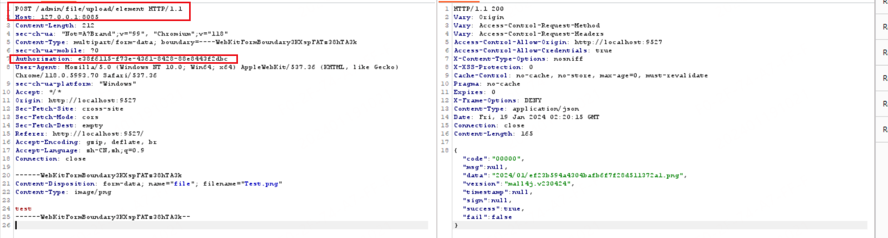

之后我们开启一个无痕窗口， 访问客户端并注册一个账号请求登录 （test:test）

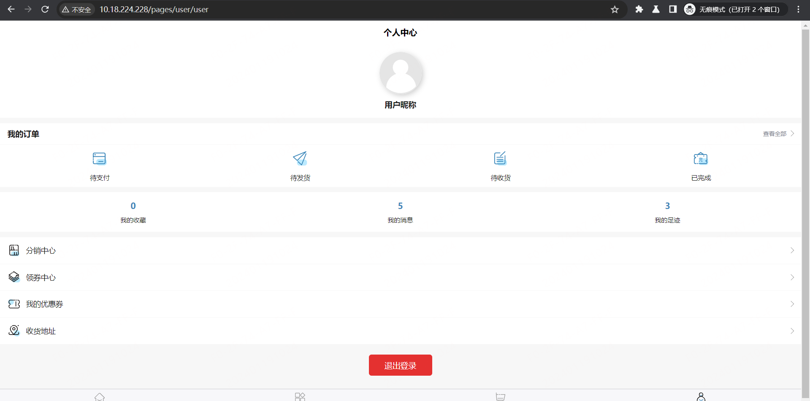

随后找到对应的 test 用户的请求信息中的 `Authorization` Header 信息

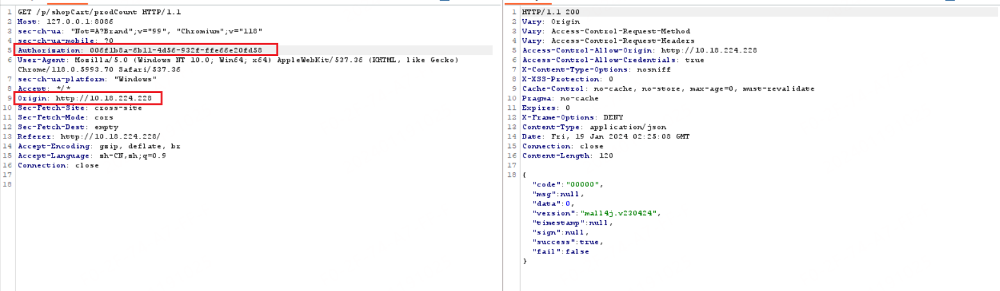

之后复制 test 用户的 `Authorization` 到之前的文件上传请求中， 并替换其中的 `Authorization` 信息， 并发送请求可以看到请求发送成功

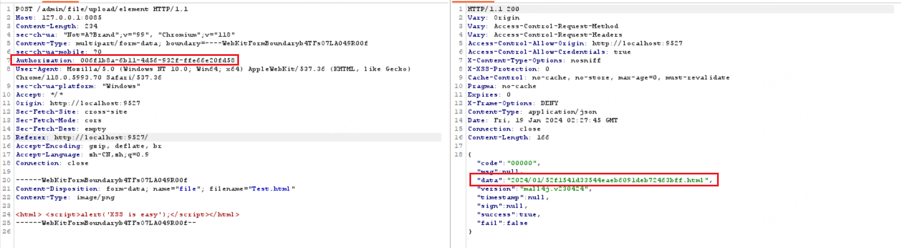

随后访问对应的文件路径即可触发 XSS 

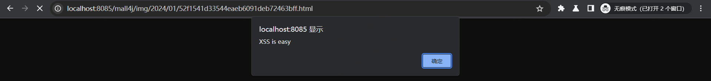

## 备注信息

- 为什么是未授权 ： 因为在 ``mall4uni`` 中并没有给出对应的文件上传位置， 用户的头像无法自定义修改， 只有管理员后台有文件上传位置

  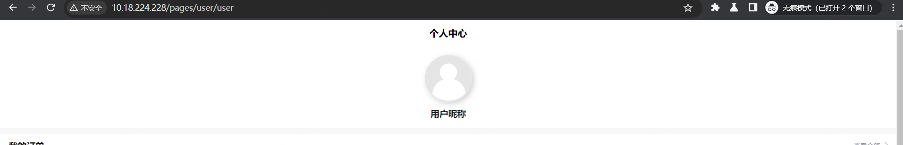

- 通过此文件上传接口可以上传任意类型的文件， 但是因为此系统默认不支持 JSP 所以只能上传 html 文件

## 真实环境

1. 网站 1

   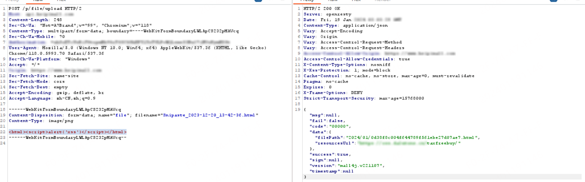

   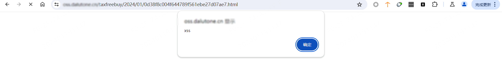

2. 网站 2

   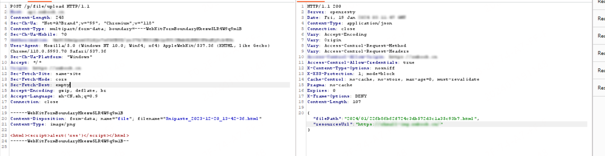

   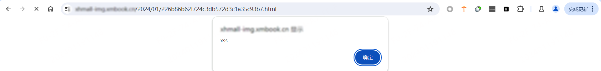

3. 网站 3

   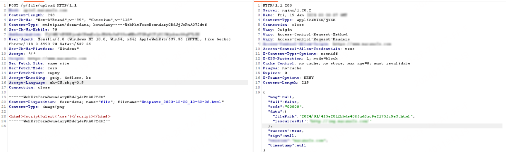

   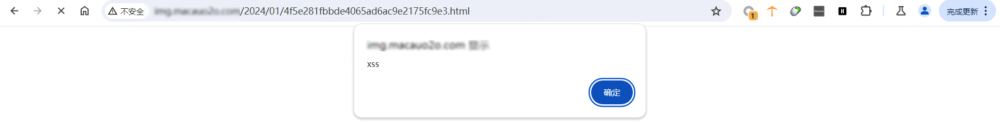

## 修复建议

- 在后台使用强校验， 限制文件上传的后缀为 `.png` `.jpg` 等等