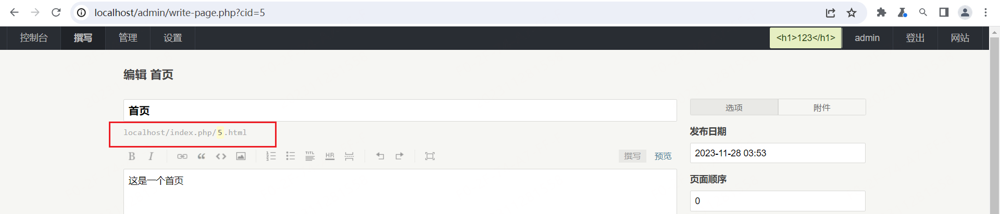
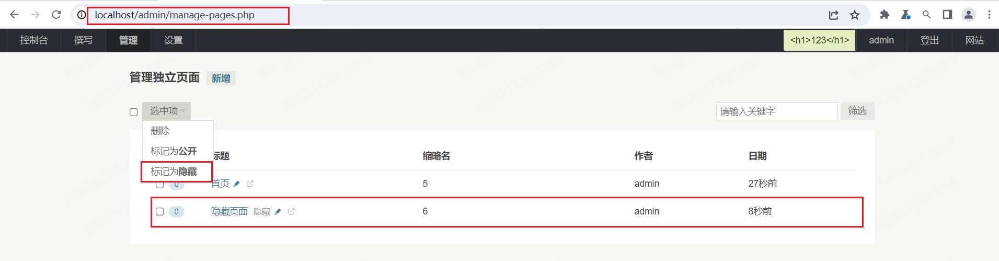
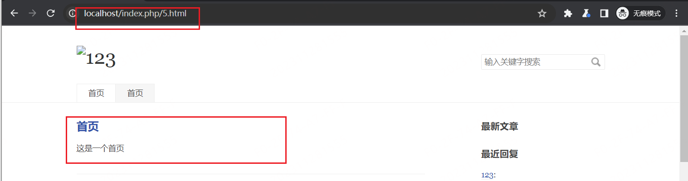
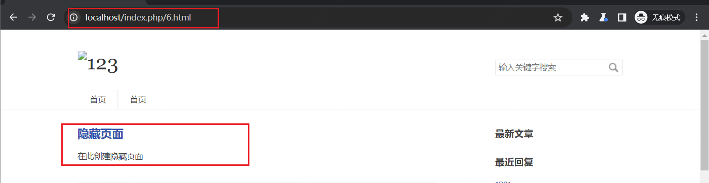

# Typecho-IDOR

## Desc

After logging in as an administrator on the Typecho website, we can create a standalone page on `/admin/manage-pages.php`. Users can also choose to hide the file on this page, but it is only hidden on the front end, and the corresponding page URL remains unchanged. If users understand the URL structure for creating pages on the website, they can still access it.

## verify

First, we need to create two standalone pages. By observing the page display, we can understand the default page URL structure as `localhost/index.php/{}.html`.

Afterward, select one of the pages to hide.

After that, open an incognito browser and revisit the website. Here, you can see that the website displays two homepage sections, with the second one being the standalone page you created. At the same time, you'll notice that the hidden page you created is not visible among them.

At the same time, when examining the website's URL address `http://localhost/index.php/5.html`, the number 5 represents the vulnerable position. Afterward, when accessing `http://localhost/index.php/6.html`, you will notice the corresponding website page.

