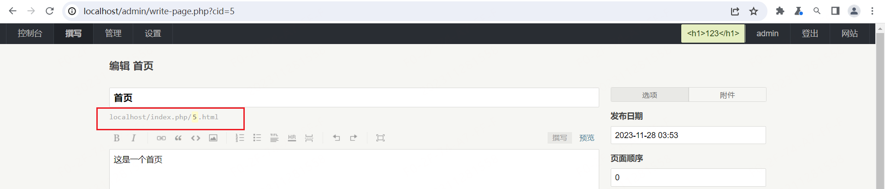
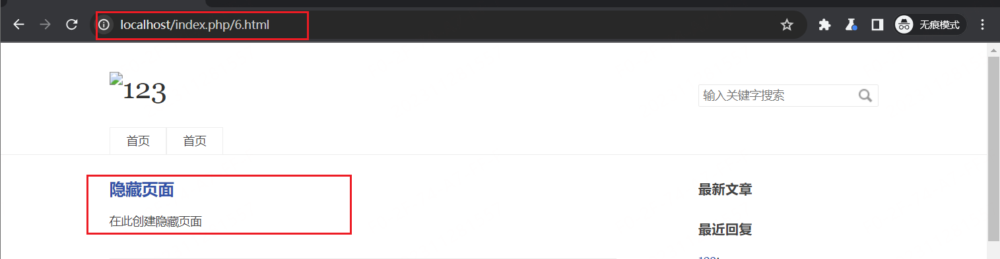

# Typecho-IDOR

## 描述

在使用管理员登录 typecho 网站后， 我们可以在 `/admin/manage-pages.php` 创建一个独立页面， 同时用户可以在此设置页面是否将文件隐藏， 但是这仅仅是在前端进行了隐藏， 对应的页面 URL 并没有改变， 此时如果用户了解网站创建页面的 URL 结构， 那么依旧可以进行访问

## 验证

首先我们需要创建两个独立页面，观察页面的显示我们可以了解到默认的页面 URL 地址结构 `localhost/index.php/{}.html`

之后选择将其中一个页面进行隐藏

之后开启一个无痕浏览器重新访问站点， 在这里可以看到网站页面显示两个首页栏， 第二个是我们创建的独立页面， 同时可以发现我创建的隐藏页面并没有显示在其中

同时查看网站的 URL 地址 `http://localhost/index.php/5.html` , 这里的 5 就是漏洞的位置， 之后开始访问 `http://localhost/index.php/6.html` 我们就可以发现对应的网站页面

