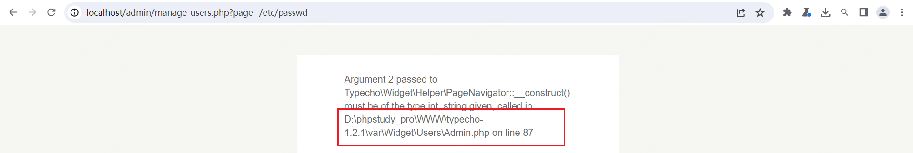

# Typecho-Information leakage

## Desc

When sending a request to `http://localhost/admin/manage-users.php?page=`, if the backend restricts the parameter to only accept numbers and we pass any other content, it will result in an error. The error message may disclose the installation directory of the website.

## Verify

