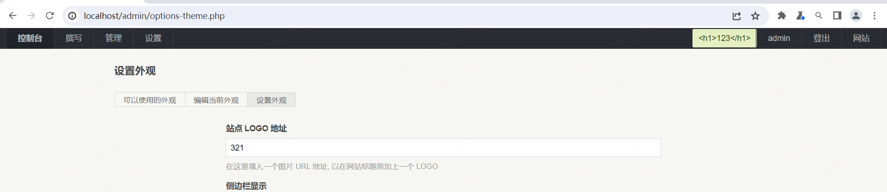
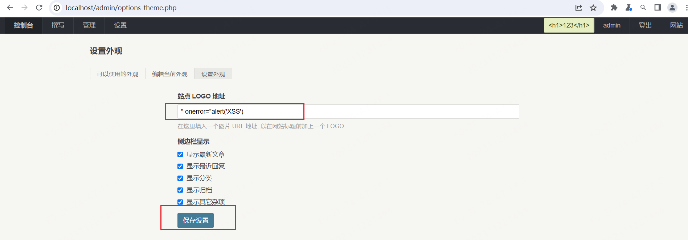
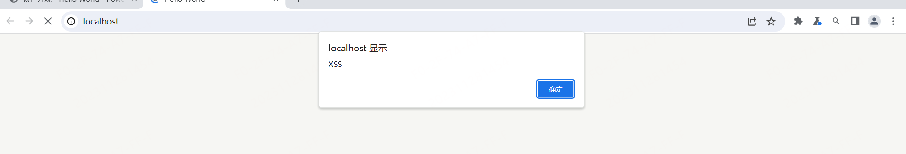

# Typecho--Stored XSS

## Desc

When logging in as an administrator in Typecho, you can go to `http://IP/admin/options-theme.php` to modify the URL link of the website's logo. Due to the lack of proper validation on the backend, it is possible to upload malicious content that executes JavaScript scripts.

## Verify

Once you have set up the environment locally, you can proceed to access the `/admin/options-theme.php` page after logging in as an administrator.



 please provide the content you would like to input in the text box.

```js
" onerror="alert('XSS')
```



Afterward, when accessing the main page, you may notice the presence of XSS rendering.

