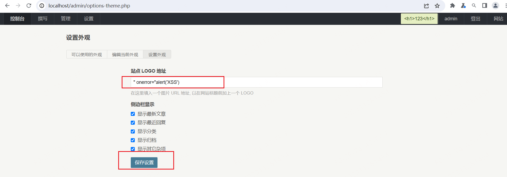

# Typecho-存储型 XSS 漏洞

## 描述

Typecho 使用管理员登录， 可以前往 `http://localhost/admin/options-theme.php` 修改网站的 LOGO 的 URL 链接， 这里由于后端没有做好校验， 因此可以上传恶意内容使其执行　JS　脚本

## 验证

在本地搭建好环境，　之后使用管理员登录后访问 `/admin/options-theme.php` 页面


在输入框中输入 下面的内容：

```js
" onerror="alert('XSS')
```



之后访问主页面， 可以发现存在 XSS 显示

