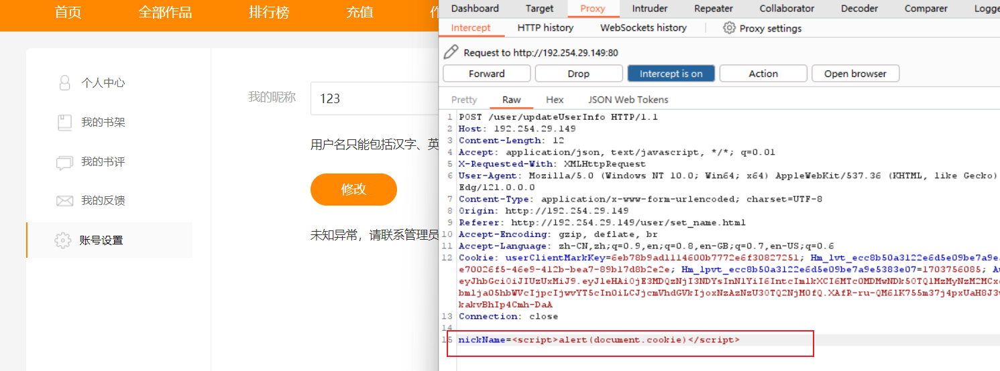
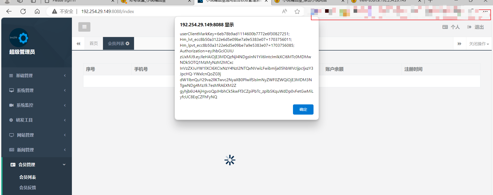

# novel_plus has a stored XSS vulnerability

## desc

There is a stored XSS vulnerability in novel_front. When modifying the user name, although verification is done to limit the content of the user name, there is no verification or insufficient verification in the background, allowing attackers to modify the uploaded content through packet capture. This results in a stored XSS vulnerability,

At the same time, because the administrator did not perform verification when viewing the user list in the background, the malicious JS submitted by the attacker will be executed in the background.

## Verify

Just register an account, we can see that the user nickname here is our mobile phone number

Then click Modify, we can see that there are some prompts telling us that we can only include content such as Chinese characters.

You can see that I modified it above to get the value of my own cookie, and then submitted it and you can see that the pop-up window started in front.

After that, we logged in to the administrator backend and accessed the member management interface, and found that the JS code we submitted had also been executed.

An attacker can use this to try to obtain the administrator's cookie and log in to the backend.

## Repair suggestions

- Try to verify the front and back ends together
- Use HTTPOnly testing or SameSite policy
- HTML encoding of display content