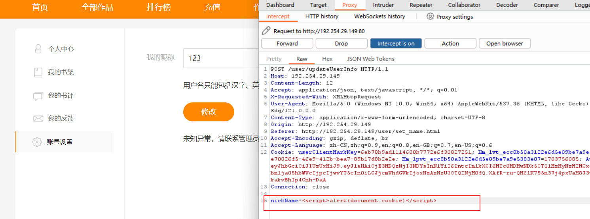
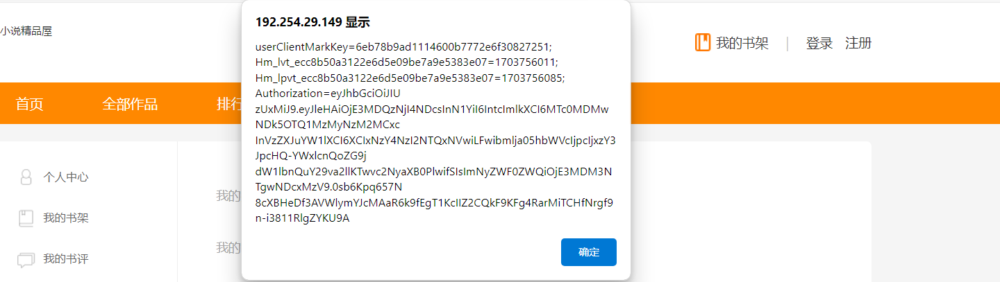
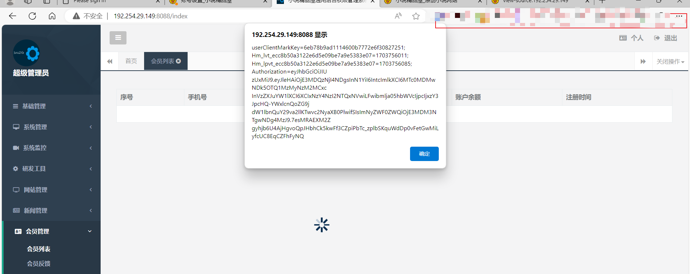

# novel_plus 存在存储型 XSS 漏洞

## 描述

novel_front 存在存储型 XSS 漏洞. 在修改用户名称的位置, 虽然做了校验限制了用户名称的内容, 但是在后台没有做校验或者校验不充分, 使得攻击者可以通过抓包修改上传的内容进而形成存储型 XSS 漏洞, 

同时由于管理员后台在查看用户列表时, 也没有做好校验, 攻击者提交的恶意 JS , 会在后台执行

## 验证

随便注册一个账号, 我们可以看到这里的用户昵称是我们的手机号

之后点击修改, 我们可以看到这里存在一些提示告诉我们只能包括汉字这类内容

可以看到我在上面修改为了获取自己的cookie 的值, 之后提交可以看到前面开始弹窗了

之后, 我们再登陆管理员后台, 访问会员管理界面, 发现我们提交的 JS 代码也被执行了,

攻击者可以借此来尝试获取管理员的 Cookie 并借此来登陆后台

## 修复建议

- 尝试进行前后端一起校验
- 使用 HTTPOnly 测试或者 SameSite 策略
- 对显示内容进行 HTML 编码