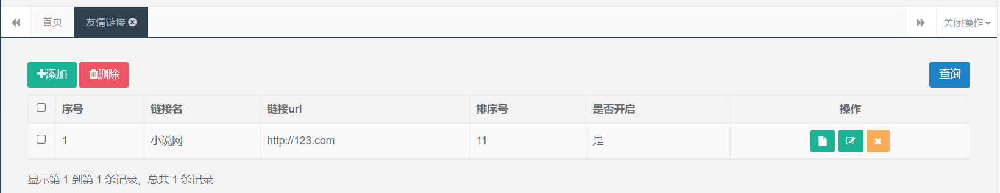
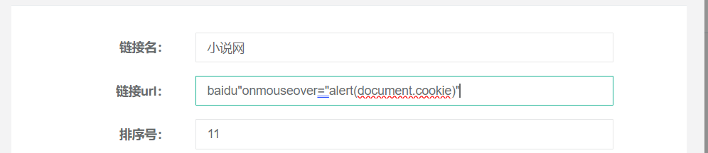
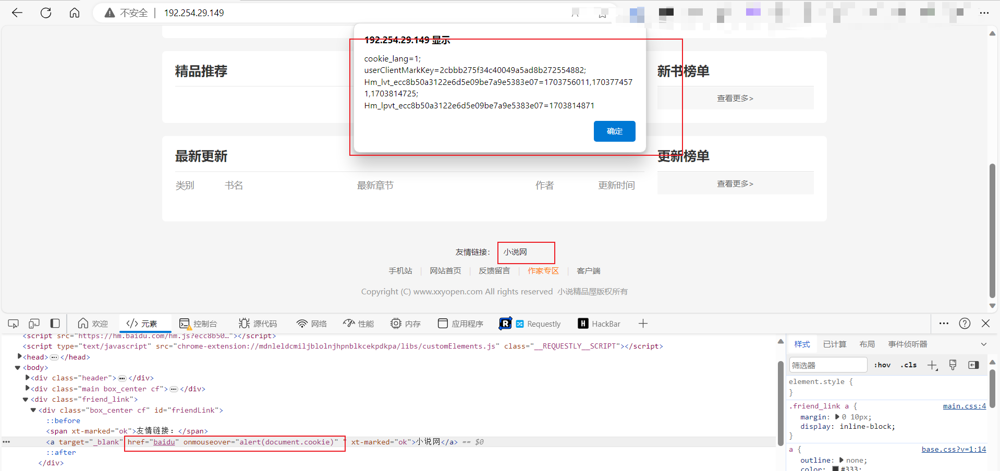

# There is a stored XSS vulnerability in the novel-plus friendly link

## desc

When the user logs in to the backend of novel-plus as an administrator, the administrator can modify the friendly links when the friendly links are displayed, but the backend does not verify and filter this part of the content, so XSS can be successfully inserted here.

Malicious users maliciously access the administrator's backend, then modify the content of the friendly link, and use the event function of the a tag to attack

## verify

Use the administrator account to log in to the backend and access the friendly link function

点击修改, 将对应的链接 url 修改为如下内容 后进行提交

Then visit the main page of the website and check the content of the link below. First we can see that the JS code is injected, and when the mouse moves to the link, a pop-up window will automatically pop up.

## Repair suggestions

- Strictly verify the link content, you can use regular expressions for verification