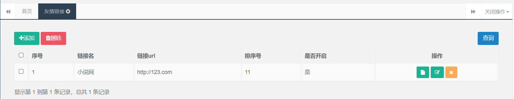
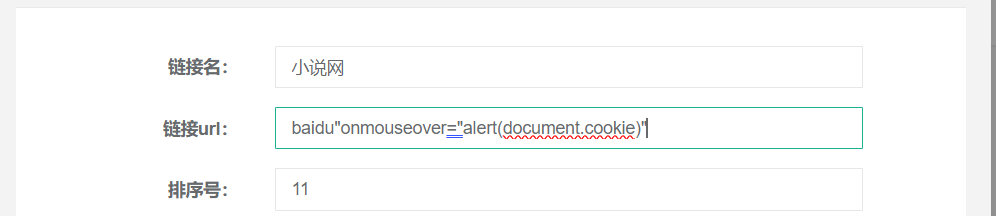
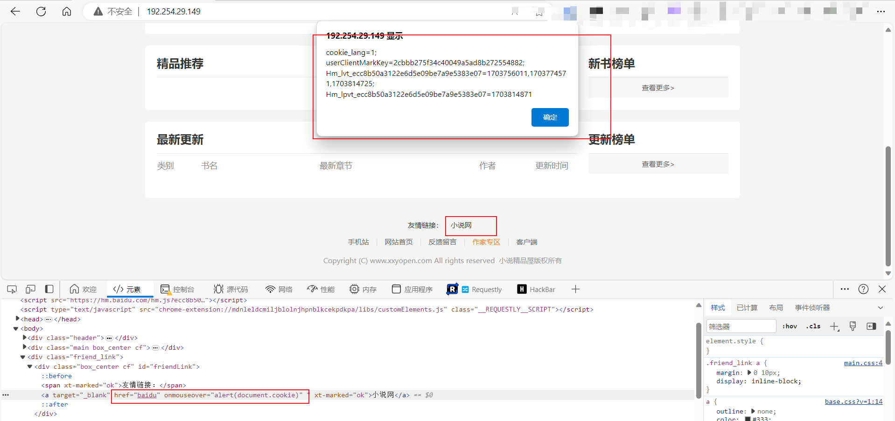

# novel-plus 友情链接 处存在存储型XSS 漏洞

## 描述

当用户以管理员身份登陆 novel-plus 的后台, 在友情链接出, 管理员可以修改友情链接, 但是后端并没有对这部分内容进行校验和过滤, 使得在此处插入 XSS 得以成功.

恶意用户恶意通过访问管理员后台, 之后修改友情链接处内容, 利用 a 标签的事件函数进行攻击

## 验证

使用管理员账号登陆后台, 访问友情链接功能

点击修改, 将对应的链接 url 修改为如下内容 后进行提交

随后访问网站主页面, 查看下面的链接处内容, 首先我们可以看到 JS 代码被注入, 而且当鼠标移动到链接出时会自动弹窗

## 修复建议

- 严格校验链接内容, 可以使用正则表达式进行校验